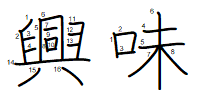
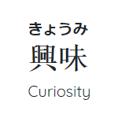

# KANJI KEEPER (漢字キーパー) 🌸

*Kanji Keeper* is a language learning platform for Japanese. It makes it easier to keep track of new words and expressions you pick up on a daily basis, and allows you to share that knowledge with other users

Features

* Basic CRUD app with favoriting, privating, and notifications features for posts

* Front-end: HTML, CSS, JavaScript, Bootstrap 4, animate.css, jQuery

* Back-end: Ruby on Rails

* Daily kanji: randomly shows a new word from a json file of joyo kanji (list of 2,136 characters) each day. The data is provided by https://kanjiapi.dev/

* Stroke order: additionally, the daily kanji shows the correct stroke order for writing the word through a font style from https://www.nihilist.org.uk/

> 

* Furigana to user posts: since logographic Chinese characters are used in the Japanese writing system to represent concepts as a single character, it is impossible to read these without prior exposure to them. Furigana is a reading aid consisting of smaller syllabic characters written in hiragana on top of the word to indicate its pronuncation. https://kuroshiro.org/ is used to convert kanji characters to hiragana for user posts

> 

* A few gems: CarrierWave for user upload files, Cloudinary for user image storage, Devise for authentication, Rinku for links...

* Real-time chat: Action Cable integrates full-duplex communications with WebSockets with the rest of the application. Since the connection is persistent, users can submit their messages at the same time and still see their respective messages appear immediately

* *Kanji Keeper* is designed with responsive web design, which adapts the layout to the viewing environment by using CSS3 media queries

Many new features to be added soon.
ありがとう！